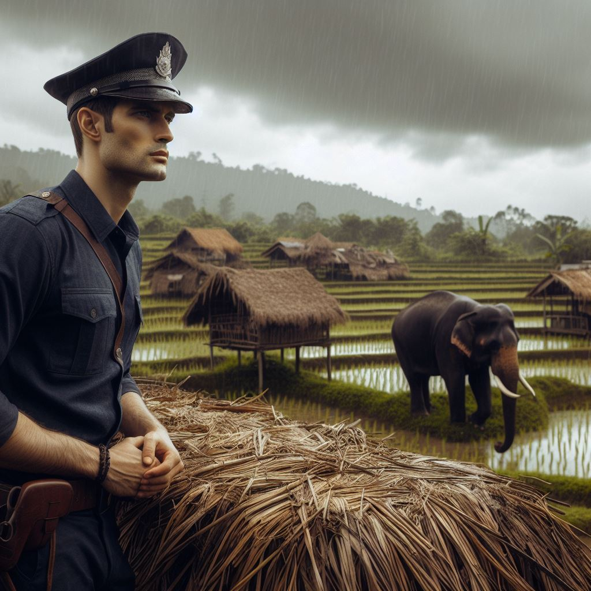

# 猎象记-乔治奥威尔

在下缅甸的毛淡棉，我遭到很多人的憎恨——在我一生之中，我居然这么引起重视，也就仅此一遭而已。我当时担任该市的分区警官，那里的反欧洲人情绪非常强烈，尽管漫无目的，只是在小事情上发泄发泄。没有人有足够的胆量制造一场暴乱，但是要是有一个欧籍妇女单身经过市场，就有人会对她的衣服吐槟榔汁。作为一个警官，我成了明显的目标，只要安然无事，他们总要捉弄我。在足球场上，会有个手脚灵巧的缅甸球员把我绊倒，而裁判（又是个缅甸人）会装着没瞧见，于是观众就幸灾乐祸地大笑。这样的事发生了不止一桩。到了最后，我走到哪里，哪里就有年轻人揶揄嘲笑的黄脸在迎接我，待我走远了，他们就在后面起哄叫骂，着真叫我的神经受不了。闹得最凶的是年轻的和尚，该市有好几千个，个个似乎都没有别的事可做，只是站在街头，嘲弄路过的欧洲人。

这使我十分着恼，也使我不解。因为那时我已认清帝国主义是桩邪恶的事，下定决心要尽早辞职滚蛋。从理论上来说——那当然是在心底里——我完全站在缅甸人一边，反对他们的压迫者英国人。至于我所干的工作，我是极不愿意干的，这种不愿意的心情非我言语所能表达。在这样的一个工作岗位上，你可以直接看到帝国主义的卑鄙肮脏。可怜巴巴的犯人给关在臭气熏天的笼子里，长期监禁的犯人面有菜色的脸，被竹杖鞭打后疤痕斑斑的屁股——着一切都使我有犯罪的感觉，压迫得我无法忍受。

但是我无法认清楚这一切。我当时很年轻，没有受过什么教育，我不得不独自默默地思索着这些问题，在东方的英国人都承受着这种沉默。我但是甚至不知道大英帝国已濒临于死亡，更不知道它比将要代替它的一些新帝国要好得多。我只知道我被夹在中间，我一边憎恨我所为之服务的帝国，但我又生那些存心不良的小鬼头的气，他们总是想方设法使我无法工作。我一方面认为英国统治是无法打破的暴政，一种长期压在被制服的人民身上的东西，另一方面我又认为世界上最大的乐事莫过于把刺刀捅入一个和尚的肚子。这样的感情是帝国主义正常的副产品；随便哪个英属印度的官员都会这么回答你，要是你能在他下班的时候问他。

有一天发生了一件事，很能间接地说明问题。这本是一件小事，但它使我比以前更清楚地看到了帝国主义的真正本质——暴虐的政府行为处事的真正动机。有一天清早，镇上另一头的一个派出所的副督察打电话给我，说是有一头象在市场上横冲直撞，问我能不能去处理一下。我不知道该怎么办，但是我想看一看究竟，就骑马出发了。

我带上了步枪，那是一支老式的0.44口径温彻斯特步枪，要打死一头象，这枪太小了，不过我想枪声可能起到恐吓作用。一路上有各种各样的缅甸人拦住我，告诉我那头象干了些什么。这当然不是一头野象，而是一头发春情的驯象。它本来是用铁锁链锁起来的，发春情的驯象都是如此，但在头一天晚上它挣脱锁链逃跑了。惟一能在发情期制服它的驯象人出来追赶，但奔错了方向，已到了要走十二小时的路程之外，而这象在清早又突然出现在镇上。缅甸人平时没有武器，对它毫无办法。它已经踩平了一所竹屋，踩死了一头母牛，撞翻了几个水果摊，饱餐了一顿；它还碰上了市里的垃圾车，司机跳车逃跑，车子被它掀翻，乱踩一气。

缅甸督察和几名印度警察在发现那头象的地方等我。这是个平民区，在一个陡峭的山边，破烂的竹屋子挤在一起，屋顶铺的是棕榈叶。我记得那是个要下雨的早晨，天空乌云密布，空气沉闷。我们开始询问大家，那头象到哪里去了，想平常一样，得不到确切的情报。在东方，情况总是这样；在远处的时候，事情听起来总是很清楚，可是你越走近出事的地点，事情就越模糊。有的人说，那头象朝那边去了，有的人又说是另一个方向，有的甚至说根本不知道有什么象逃跑的事。我几乎觉得整个事情可能都是谎话，这时忽然听到不远的地方有人在嚷嚷。我听到一声惊恐的喊叫：“走开！孩子！马上给我走开！”这时我见到一个老妇人手中拿着一根树枝从一所竹屋的后面出来，使劲地赶着一群赤身裸体的孩童。后面跟着另外一些妇女，嘴上啧啧出声，表示惊恐；显然那里有什么东西不能让孩子们见到。

我绕到竹屋的后边，看到一个男人的尸体躺在泥中。他是个印度人，一个黑皮肤的德拉维苦力，身上几乎一丝不挂，死去没有几分钟。他们说那头象在屋子边上突然向他袭来，用鼻子把他捉住，一脚踩在他背上，把他压扁在地上。当时正好是雨季，地上泥土很软，他的脸在地上划出了一条槽，有一尺深，几尺长。他俯扑在地上，双手张开，脑袋扭向一边。他的脸上尽是泥，睁大双眼，龇牙咧嘴，一脸剧痛难熬的样子。（可别对我说，凡是死者脸上表情都是安详的。我所见到的尸体中，大多数是惨不忍睹的。）大象的巨足在他背上撕开皮，想剥兔皮一样干净利落。我一见到尸体，就马上派人到附近一个朋友家里去借一支打象的步枪来。我已经把我的马送走，免得它嗅到象的气味，受惊之余把我从它背上颠下来。

派去的人几分钟后便带着一支步枪和五颗子弹回来，这中间又有几个缅甸人来到，告诉我们，那头象就在下面的稻田里，只有几百码远。我一起步走，几乎全区人人都出动了，他们从屋里出来跟着我。他们看到了步枪，都兴奋地叫喊说我要去打死那头象了。在那头象撞倒踩踏他们的竹屋时，他们对它并不表现出有多大的兴趣，可是如今它要给开枪打死了，情况忽然之间就不同了。他们觉得有点好玩，英国群众也会如此。此外，他们还想弄到象肉。这使我隐隐约约地感到有些不安。我并没有打算打死那头象——我派人去把那支枪取来只不过是在必要的时候进行自卫而已——而且有一大群人跟在你后面总是令你有些精神紧张。我大步下山，肩上扛着那支步枪，后面紧紧跟随着一群越来越多的人，看上去一定像个傻瓜，心中也感到自己成了一个傻瓜。到了山脚下，离开了那些竹屋子，有一条铺了碎石子的路，在过去，就是一片到处都是泥浆的稻田，有一千码宽，还没有犁过田，因为下过雨，田里水汪汪的，零零星星地长着些杂草。那头象站在路边八码远的地方，左侧朝着我们。它一点也没有注意到群众的靠近。它把成捆的野草拔下来，在双膝上拍打，打干净了以后就送进嘴里。

我在碎石路上停了步。我一见到那头象就完全有把握知道不应该打死它。把一头能做工的象打死是桩很严重的事，这等于是捣毁一太昂贵的巨型机器，事情很明显，只要能够避免就要尽量避免。在那么一段距离之外，那头象安详地在嚼草，看上去想一头母牛一样没有危险。我当时想——我现在也这么想——它的发情大概已经过去了，因此它顶多就是漫无目的地在这一带闲逛，当驯象人回来逮住它。何况，我当初根本不想开枪打它。因此我决定从旁观察，看它不再撒野了，我就回去。

但是这时我回头看了一眼跟我来的人群。人越聚越多，至少已经有两千人了，把马路两头都远远地堵死了。我看着花花绿绿衣服上的一张装黄色的脸，这些脸都为了这一点看热闹的乐趣而现出高兴和兴奋的神情，大家都认定这头象必死无疑了。他们看着我，就想看着魔术师变戏法一样。他们并不喜欢我，但是由于我手中有那支神奇的枪，我就值得一观了。我突然明白了，我非得射杀那头大象不可。大家都这么期待着我，我非这么做不可；我可以感觉到他们两千个人的意志在不可抗拒地把我推向前。

就在这个档儿，就在我手中握着那支步枪站在那儿的时候，我第一次看到了白人在东方的统治的空虚和无用。我这个手中握着枪的白人，站在没有任何武装的本地群众面前，表面看起来似乎是一出戏的主角；但实际上我不过是身后这些黄脸的意志所推来推去的一个可笑的傀儡。我这时看到，一旦白人开始变成暴君，他就毁了自己的自由。他成了一个空虚的、装摸作样的木头人，常见的白人老爷的角色。因为正是他的统治使得他一辈子要尽力锁住“土著”，因此在每一次紧急时刻，他非得做“土著”期望他做的事不可。他戴着面具，日子长了以后，他的脸按照面具长了起来，与面具吻合无间了。我非得射杀那头象不可，我在派人去取枪时就不可挽回地表示要这样做了。白人老爷的行为必须像个白人老爷；他必须表现出态度坚决，做事果断。手里握着枪，背后又有两千人跟着，到了这里又临阵胆怯，就此罢手，这可不行。大家都会笑话我，我整个一生，在东方的每一个白人的一生，都是长期奋斗的一生，是绝不能给人笑话的。

但是我又不愿意射杀那头大象。我瞧着它卷起一束草在膝头甩着，神情专注，像一个安详的老祖母。我觉得朝它开枪无异于是谋杀。按我当时的年龄，杀死个把兽类我是没有什么顾忌和不安的，但是我从来没有开枪打过大象，我也不想这么做。（杀死巨兽总是使人觉得更不应该一些。）何况，还有象主人得考虑。这头活象至少可值一百镑，死了，只有象牙值钱，可能卖五镑。不过我得马上行动。我转身向几个原来已在那里的看起来颇有经验的缅甸人，问他们那头象老不老实。他们说的都一样：如果你让它去，它不理你；如果你走得太近，它就向你冲来。

我该怎么办，看来很清楚。我应该走近些，大约二十五码左右，去试试它的脾性。要是它冲过来，我就开枪；要是它不理我，那就让它去，等驯象人回来再说。但是我也知道，这事我恐怕办不到。我的枪法不好，田里的泥又湿又软，走一步就陷一脚。要是大象冲过来而我又没有射中，我的命运就像推土机下的一只蛤蟆。不过即使在这时候，我想的也并不完全是自己的性命，而是身后那些看热闹的黄脸。因为在这时候，有这么多人瞧着我，我不能像只有自己一个人那样害怕。在 “土著”面前，白人不能害怕；因此，一般来说，他是不会害怕的。我心中唯一的想法是，要是出了差错，那两千个缅甸人就会看到我被大象追逐、逮住、踩成肉酱，就像山上那个龇牙咧嘴的印度人尸体一样。我不能让他们笑话我。只有一个办法。我把子弹上了膛，趴在地上好瞄准。

人群十分寂静，许许多多人的喉咙里叹出了一口低沉、高兴的气，好像看戏的观众看到帷幕终于拉开时一样，终于等到有好戏可瞧了。把支漂亮的德国步枪上有十字瞄准线。我当时根本不知道，要射杀一头象得瞄准双耳的耳孔之间的一条假想线，开枪把它切断。因此，如今这头大象侧着身子对我，我就应该瞄准直射它的一只耳孔就行了；但实际上，我却把枪头瞄准在耳孔前面的几英寸处，以为象脑在这前面。

我扣扳机时，没有听到枪声，也没有感到后坐力——开枪的时候你总是不会感到的——但是我听到了群众顿时爆发出高兴的欢叫声。就在这个档儿—— 真是太快了，你会觉得子弹怎么会这么快就飞到了那里——那头象一下子变了样，神秘而又可怕地变了样。它没有动，也没有倒下，但是它的身上的每一根线条都变了。它一下子变老了，全身萎缩，好像那颗子弹的可怕威力没有把它打得倒下，却使它僵死在那里了。经过很长时候，我估计大约有五秒种，它终于四腿发软跪了下来。它的嘴巴淌口水。全身出现了老态龙钟的样子。你觉得它仿佛已有好几千岁了。我朝原来的地方又开了一枪。它中了第二枪后还不肯瘫倒，虽然很迟缓，但还是努力要站起来，勉强地站着，四腿发软，脑袋耷拉。我开了第三枪。这一枪终于结果了它。你可以看到这一枪的痛苦使它全身一震，把它四条腿剩下的一点点力气都打掉了。但它在倒下的时候还好像要站起来，因为它两条后腿瘫在它身下时，它仿佛像一块巨石倒下时一样，上身却抬了起来，长鼻冲天，像棵大树。它长吼一声，这是它第一声吼叫，也是仅有的一声吼叫。最后它肚子朝着我这一边倒了下来，地面一震，甚至在我趴着的地方也感觉得到。

我站了起来。那些缅甸人早已抢在前面跑到田里去了，显然那头象再也站不起来了，但它还没死，它还在有节奏地喘着气，喉咙呼噜呼噜地出声，它的半边身子痛苦地一起一伏，它的嘴巴张得大大的，我可以一直看到粉红色的喉咙的深处。我等它死去，等了很久，但它的呼吸并不减弱。最后我把剩下的两颗子弹射到我估计是它心脏的位置。浓血喷涌而出，好像红色的天鹅绒一般，可是它还不肯死。它中枪时身子并不震动，痛苦的喘息仍继续不断。它在慢慢地、极其痛苦地死去，但是它已到了一个远离我的世界，子弹已经不能再伤害它了。我觉得我应该结束那讨厌的喘息声。看着那头巨兽躺在那里，没法动弹，又没法死掉，又不能把它马上结果掉，很不是滋味。我又派人去把我的小口径步枪取来，朝它的心脏和喉咙里开了一枪又一枪。但似乎一点影响也没有。痛苦的喘息声继续不断，就像钟声滴答一样。

我终于再也无法忍受了，就离开了那里。后来听说它过了半个小时才死掉。缅甸人还没有等我走开就提着桶和篮子来了，据说到了下午他们已把它拨剥得只剩骨骼了。

后来，关于射杀那头象的事，当然议论不断。象主人很生气，但他是个印度人，一点也没有办法。何况，从法律的观点来说，我做的并不错，因为如果主人无法控制的话，发狂的象是必须打死的，就像疯狗一样。至于在欧洲人中间，意见就不一样了。年纪大的人说我做的对，年纪轻的人说为了踩死一个苦力而开枪打死一头象太不像话了，因为象比科林吉苦力值钱。我事后心中暗喜，那个苦力死得好，使我可以明正言顺地射死那头象，在法律上处于正确地位。我常常在想，别人知不知道我射死那头象只是为了不想在大家面前显得像个傻瓜而已。

| 提纲序号 | 故事内容 |
| --- | --- |
| 1 | 叙述者描述起初对失控大象的追查 |
| 2 | 叙述者在村庄找到被大象踩死的苦力的尸体 |
| 3 | 叙述者决定借用步枪，以防大象再次发起攻击 |
| 4 | 叙述者跟随大象的踪迹，同时村民们也跟随着他 |
| 5 | 叙述者看到大象在稻田里安静地吃草，开始怀疑是否应该射杀大象 |
| 6 | 由于村民们的期待和他自己的身份压力，叙述者决定射杀大象 |
| 7 | 叙述者向大象开火，大象的死亡过程缓慢而痛苦 |
| 8 | 叙述者离开现场，村民们开始剥取大象的肉 |
| 9 | 叙述者回顾事件，对于他的行为给出自我解释和反思 |